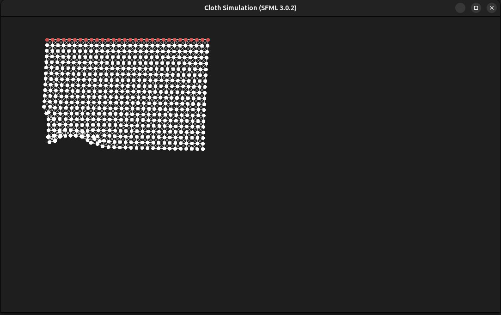
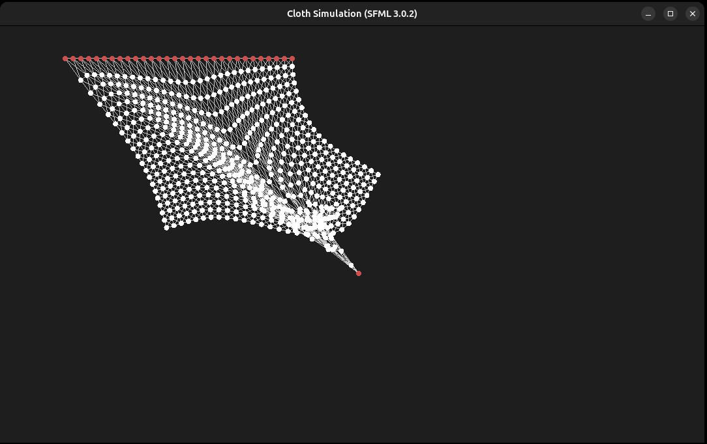

# Cloth Simulation (SFML 3.0.2)

A simple 2D cloth physics simulation written in C++ and rendered using **SFML 3.0.2**.  
It demonstrates Verlet integration, distance constraints, and interactive dragging of cloth particles.

---

## 📸 Screenshots

| Simulation running | Dragging particles |
|:------------------:|:------------------:|
|  |  |

---

## 🧩 Features
- Real-time cloth physics using simple constraints  
- Particle-based Verlet integration  
- Interactive mouse dragging of particles  
- Written in modern C++17  
- Built entirely with **CMake** and **SFML 3**

---

## ⚙️ Requirements

- **C++17** compiler (GCC ≥ 9, Clang ≥ 10, or newer)
- **CMake ≥ 3.16**
- **SFML 3.0.2** (graphics, window, system components)
- Linux desktop environment (X11 or Wayland)

---

## 📦Build & Run

- cmake -S . -B build
- cmake --build build -j
- ./build/bin/cloth_sim

